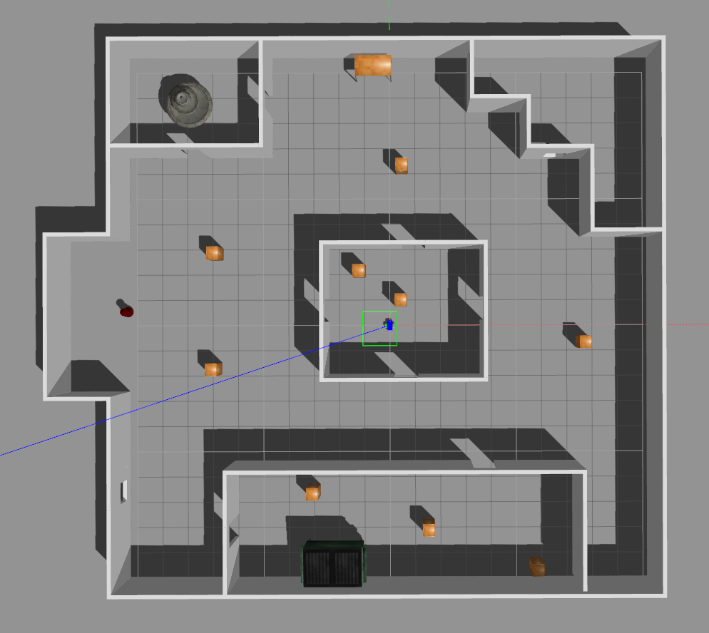

# Map My World

### Dependencies

* [ROS Kinetic](http://wiki.ros.org/kinetic)
* [Gazebo for ROS Kinetic](http://gazebosim.org/tutorials?tut=ros_installing&cat=connect_ros)
* [pgm_map_creator](https://github.com/hyfan1116/pgm_map_creator) (To create the overlay of map)
	0. `sudo apt-get install libignition-math2-dev protobuf-compiler`
	1. `cd PATH_TO/Where_Am_I/src`
	2. `git clone https://github.com/udacity/pgm_map_creator.git`
	3. `cd ..`
	4. `catkin_make`
* ros-teleop:
	1. `cd PATH_TO/Where_Am_I/src`
	2. `git clone https://github.com/ros-teleop/teleop_twist_keyboard`
	3. `cd ..`
	4. `catkin_make`
*  [RTAB-MAP Package](http://wiki.ros.org/rtabmap_ros)

### Overview
Mapping an environment in Gazebo

### How to run it
TO DO: 
1. Clone this repo: `git clone https://github.com/martinezedwin/Map_My_World.git`
2. Install ROS and Gazebo (from the project directory `chmod +x setup.sh && ./setup.sh`)
3. Install ros-teleop (see commands under Dependencies)
4. Install RTABMAP (`sudo apt-get install ros-kinetic-rtabmap-ros`)
5. Run the run_world_1.sh script: `chmod + x run_world_1.sh && ./run_world.sh`. 
6. Run the mapping script: `chmod + x mapping_4.sh && ./mapping_4.sh`
7. Control the bot: `chmod + x teleop_3.sh && ./teleop_3.sh` and start moving the robot to map.
8. Check the images: `rtabmap-databaseViewer rtabmap.db` from the folder of the .db file.

### Results
One you're done, you have stopped the mapping node:

Note: The 6 closed loops

You can download the rtabmap.db file produced here: https://drive.google.com/open?id=19wmurnAcIqim8H_t3Vv-GHZXGmpSZnBM

After moving for a bit, the robot quickly localizes:

|   Actual           |    Mapped     |
|---------------|----------|
|| |

	

